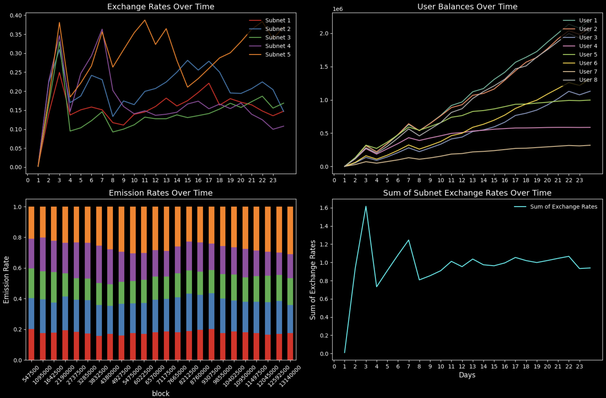

## RAO Simulation - "Framework"



A simulation framework for modeling and analyzing subnet interactions, account balances, and trade activities within the RAO network. The project includes modules for running simulations, storing results, and visualizing outcomes through plots.

## Requirements

To run and use, ensure you have the following installed:

- **Python 3.7+**
- `matplotlib`
- `numpy`
- `pandas`

## Installation

1. **Clone the Repository:**

```bash
git clone https://github.com/learnbittensor/rao-simulation.git
cd rao-simulation
```

2. **Install Dependencies:**

It's recommended to use a virtual environment:

```bash
python3 -m venv .venv
source .venv/bin/activate  # On Windows: .venv\Scripts\activate
pip install -r requirements.txt
```

## Usage

### Running Simulations

1. **Configure the Simulation:**

Go to the `./simulations` directory and modify or create a simulation configuration as needed. An example configuration is provided in `example.py`.

2. **Execute the Simulation:**

Run the simulation script to generate the JSON data files.

`python3 -m simulations.example`

*This will generate the following JSON files in the `/data` directory:*

- `accounts.json`
- `subnets.json`
- `subtensor.json`
- `trades.json`

## Example Simulation Configuration

Here's an example of how a simulation configuration (example.py) is structured:

```python
from src.models import Subnet, Account, Trade
from src.simulation import run_simulation
from src.plotting import plot_simulation_results

blocks = 13140001
n_steps = 547500

subnets = [
    Subnet(id=0, tao_in=1000.0, alpha_in=1000.0, alpha_out=1000.0, is_root=True),
    *[Subnet(id=i, tao_in=1000.0, alpha_in=1000.0, alpha_out=1000.0)
      for i in range(1, 4)],
]

accounts = [
    Account(id=1, free_balance=100.0, registered_subnets=[0, 1, 2, 3], alpha_stakes={}),
    Account(id=2, free_balance=100.0, registered_subnets=[1, 2, 3], alpha_stakes={}),
]

trades = [
    Trade(block=0, account_id=1, subnet_id=0, action='buy', amount='all'),

    Trade(block=0, account_id=2, subnet_id=1, action='buy', amount='33.3'),
    Trade(block=0, account_id=2, subnet_id=2, action='buy', amount='33.3'),
    Trade(block=0, account_id=2, subnet_id=3, action='buy', amount='33.3'),

    Trade(block=13140000, account_id=1, subnet_id=0, action='sell', amount='all'),
    Trade(block=13140000, account_id=1, subnet_id=1, action='sell', amount='all'),
    Trade(block=13140000, account_id=1, subnet_id=2, action='sell', amount='all'),
    Trade(block=13140000, account_id=1, subnet_id=3, action='sell', amount='all'),

    Trade(block=13140000, account_id=2, subnet_id=1, action='sell', amount='all'),
    Trade(block=13140000, account_id=2, subnet_id=2, action='sell', amount='all'),
    Trade(block=13140000, account_id=2, subnet_id=3, action='sell', amount='all'),
]

config = {
    "blocks": blocks,
    "n_steps": n_steps,
    "subnets": subnets,
    "accounts": accounts,
    "trades": trades,
    "tao_supply": 200.0,
    "global_split": 0.5,
    "balanced": True,
    "root_weight": 0.5
}

if __name__ == "__main__":
    run_simulation(config)
    plot_simulation_results("data", blocks, n_steps)
```

## Running the Project

1. **Run the Simulation:**

`python3 -m simulations.example`

*This will execute the simulation with the defined configuration and generate JSON data files in the data/ directory.*

## License

This project is licensed under the [MIT License](LICENSE).

## Acknowledgements

- Modified and reused code from the simulation notebook of Const. (Thank you) <3
